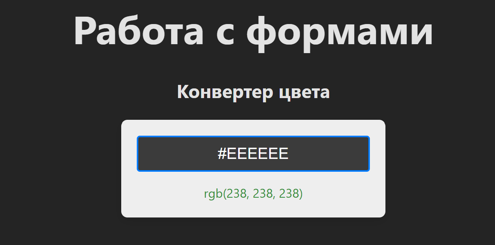
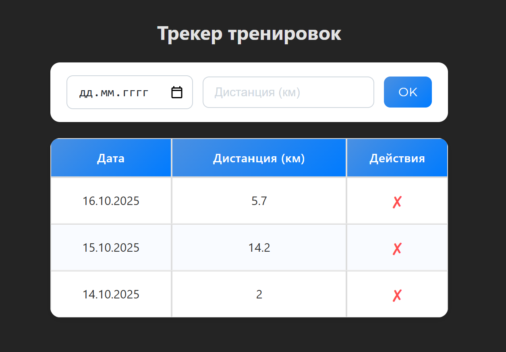

# Домашнее задание к занятию «Формы»

---

## Статус проекта

[](https://github.com/dm-morozov/netology_68_react-forms/actions/workflows/web.yaml)


---

## 🎯 Обзор Проектов

Данный репозиторий содержит два учебных React-приложения, разработанных с использованием TypeScript, которые фокусируются на работе с формами, управлении состоянием, валидации и манипуляции с массивами.

[**Ссылка на проект на GitHub Pages**](https://dm-morozov.github.io/netology_68_react-forms/)

### 1\. Конвертер Цвета (HEX в RGB) 🎨

Небольшое приложение для ввода и валидации HEX-цвета с мгновенным отображением результата и визуальной обратной связью.



### 2\. Учёт Тренировок 💪

Приложение для ведения журнала тренировок/прогулок, которое демонстрирует управление сложным состоянием (массив объектов), обработку событий, а также логику суммирования и сортировки данных.



---

## 💡 Освоенные Концепции

В ходе разработки были применены следующие ключевые принципы и технологии:

### React/TypeScript Основы

- **Контролируемые Компоненты (Controlled Components):** Использование `useState` для управления значением каждого поля ввода (`<input>`) в форме.
- **Управление Потоком Данных:** Реализация потока данных **снизу-вверх** (из дочерней формы в родительский трекер) с помощью передачи функций-обработчиков через пропсы (`onAddOrUpdateWorkout`).
- **Асинхронность `useState`:** Понимание того, что обновление состояния является асинхронным процессом, и как это влияет на `console.log`.

### Состояние и Жизненный Цикл

- **Хук `useEffect`:** Использование для реализации **побочных эффектов**, не связанных напрямую с рендером, например, для изменения стилей внешнего DOM-элемента (`container.style.backgroundColor`).
- **Хук `useRef`:** Использование для получения прямой, "иммутабельной" ссылки на DOM-элемент компонента (`containerRef`) без использования `document.querySelector`.

### Манипуляция Данными и Логика

- **Иммутабельность Состояния:** Обновление массивов и объектов состояния (`workouts`) всегда происходит через создание _новых_ массивов (`[...workouts, newEntry]`) и объектов, что является краеугольным камнем работы в React.
- **Сложная Логика Массивов (CRUD):**
  - **Добавление/Суммирование:** Поиск существующей записи по дате (`.findIndex()`) и обновление ее значения (`.map()`).
  - **Удаление:** Фильтрация массива для исключения элемента по уникальному ID (`.filter()`).
  - **Сортировка:** Корректная сортировка массива по датам (по убыванию) с использованием `new Date().getTime()`.
- **Валидация и Форматирование:**
  - **Форма:** Реализация фильтрации ввода (только HEX-символы) и контроль длины прямо в обработчике `onChange`.
  - **Таблица:** Форматирование даты из **ISO-формата** (`YYYY-MM-DD`) в **ДД.ММ.ГГГГ** для отображения.

### Архитектура

- **ООП-Подход:** Разделение логики (функции `processHexInput` в `utils`) от UI-компонентов.
- **CSS Modules:** Использование `.module.css` для обеспечения локальной области видимости и избежания конфликтов стилей.

---

## 🧩 Структура Проектов

```
src/
├── components/
│   ├── ColorConverter/              # Проект 1: Конвертер цвета
│   │   ├── ColorConverter.tsx
│   │   └── ColorConverter.module.css
│   ├── WorkoutTracker/              # Проект 2: Трекер тренировок
│   │   ├── WorkoutTracker.tsx       # Контейнер: состояние, логика суммирования/сортировки/удаления
│   │   ├── WorkoutForm.tsx          # Форма ввода
│   │   ├── WorkoutTable.tsx         # Таблица отображения
│   │   └── WorkoutTracker.module.css
│   └── ...
├── types/                           # Общие TypeScript интерфейсы
│   ├── color.ts
│   └── workout.ts
├── utils/                           # Чистая (не зависящая от React) логика
│   └── colorUtils.ts
└── App.tsx                          # Главный компонент
```

---

## 📧 Контакты

Если возникнут вопросы, пишите:

-  [LinkedIn](https://www.linkedin.com/in/dm-morozov/)
-  [Telegram](https://t.me/dem2014)
-  [GitHub](https://github.com/dm-morozov/)
